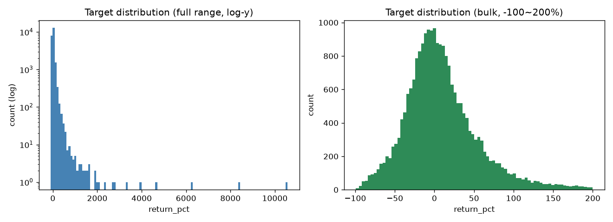
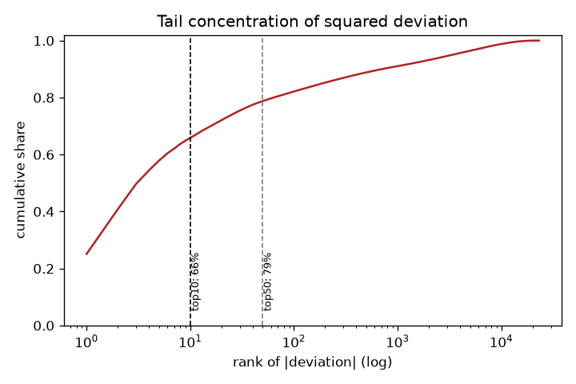
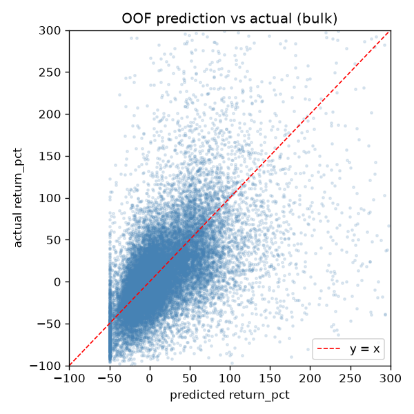
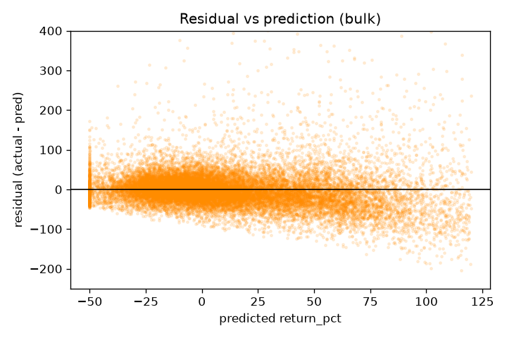
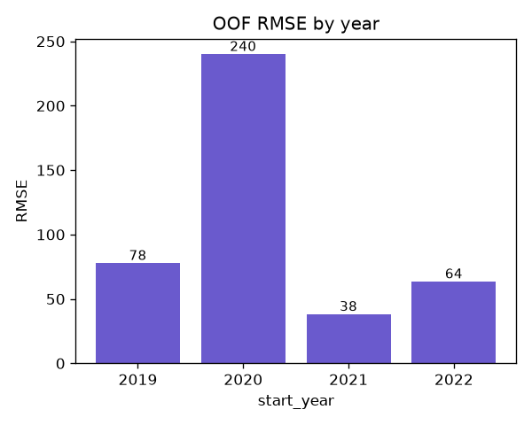
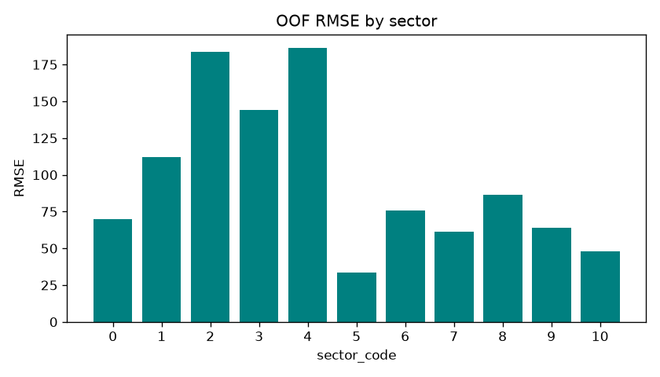

# 股票一年期報酬率預測 — 方法與實驗報告

> 目標：以 `train.csv` 訓練、預測 `test.csv` 的 `return_pct`（一年期前瞻報酬 %），
> 唯一評分指標為**原始尺度 RMSE**，繳交對齊 `sample_submission.csv`。
> 執行環境：anaconda `imaginary`（`C:/Users/tfx92/anaconda3/envs/imaginary/python.exe`）。

---

## 0. 一頁總結（TL;DR）

- **最佳提交**：GBDT 三劍客（LightGBM + XGBoost + CatBoost）集成 + OOF 鎖定的後處理，**Public LB = 14753.04**。
- **OOF RMSE = 127.31**，勝過 naive 基準線（138.65）約 8%；其中**主體 RMSE 僅 57，尾部 top50 RMSE 高達 2446** → 分數幾乎完全由極端離群值主導。
- **關鍵發現**：測試集 ticker 匿名、與訓練集**零重疊**，且全為 2024 新年度 → ticker 編碼、跨時間 panel lag 全部失效，改用**橫斷面排名特徵**。
- **LB 是離群值主導**：模型解釋了約 **11% 的報酬變異**（相對均值基準），已是 1 年期股票報酬的好成績；**理論實務地板估計約 13,500–14,000**，再低需要的是更好的資料而非更強的模型。
- **負面實驗（皆有助於理解問題本質）**：加入 DL 讓 OOF 變好（127.00）但 **LB 變差（14844）**；全域上移、隨機項、過擬合在這個指標上**數學上/實證上都有害**。誠實、保守、不過度優化是這份資料的最優策略。

---

## 1. 資料診斷（決策的根據）

| 項目 | 實測 | 對策 |
|---|---|---|
| 訓練集 | 23,070 列、2019–2022、真實 ticker（AAPL…）、1,734 檔 | — |
| 測試集 | 8,520 列、**全為 2024**、**ticker 匿名且零重疊**、2,200 檔、每檔 ~4 列 | **棄用 ticker 身分** |
| 測試集缺欄 | 無 `period_start`/`period_end`（季別） | 不可用季別、不可用跨時間 panel lag |
| 目標分布 | mean 18.8、std 138.6、max 10571、skew 38、kurt 2329 | 極端肥尾 |
| 尾部集中 | 報酬最高 10 列占總平方誤差 ~66%、前 50 列 ~79% | **裁剪/收縮後處理是最高槓桿** |
| 缺失結構 | dividends_paid_ttm 93%、dividend_yield 72%、gross_margin 62%…（train/test 一致） | 缺失指示為強特徵 |
| 特徵尺度 | pe_ttm、roe 等橫跨 ±1e8~1e10 | 樹模型免疫；DL 須分位轉換 |

**核心策略**：預測好主體（bulk），用 OOF 驗證找出的裁剪/收縮把不可預測的尾部壓回中庸值。GBDT 為主幹，**所有後處理參數一律由 OOF 決定**。

### 與原始流程文件的明確偏離（皆由資料診斷驅動）
1. **棄用 ticker target-encoding / embedding** — 測試 ticker 匿名零重疊，身分無法泛化。
2. **棄用跨時間 panel lag（QoQ/YoY 滯後）** — 測試集無日期排序、單一年度，無法重現；改以橫斷面排名捕捉相對位置。
3. **DL 最終不納入正式提交** — 實測 OOF 改善但 LB 變差（見 §5）。

---

## 2. 方法設計

### 2.1 特徵工程（`pipeline/features.py`，train/test 共用同一函式，共 107 維）
- **原始數值**：33 個基本面欄位原樣保留（GBDT 原生吃 NaN，不填補）。
- **缺失指示**：每個數值欄建 `is_missing_*` + 每列缺失總數 `n_missing`（強 meta 特徵）。
- **橫斷面年內百分位排名**（核心）：在**每個 start_year 群組內**對估值/品質比率取 `rank(pct=True)`，消除跨年水準差異。
- **產業相對 z-score**：在 `sector_code × start_year` 內標準化關鍵比率。
- **規模代理**：revenue / assets / 市值代理取 `log1p` 並年內排名（小規模＝尾部風險訊號）。
- **衍生比率**：`ni/assets`、`ltd/assets`、`goodwill/assets`、稀釋差距…等。
- **可重現性保證**：所有跨樣本統計都在各自 DataFrame 的 start_year 群組內計算，測試集 2024 自成 cohort，無時間洩漏。

### 2.2 驗證設計（`pipeline/cv.py`）
- **主 CV = GroupKFold(by ticker, 5 折)**：驗證折 ticker 未見過 → 貼近「測試集為新 ticker」，且每列恰被預測一次 → 全覆蓋 OOF（後處理/集成必需）。
- **診斷 = Walk-forward 分年**：train≤Y → val(Y+1)，檢查時間/regime 穩健度。
- **Naive 基準線**：全域均值、產業×年均值。模型必須勝過。

### 2.3 模型（`pipeline/models.py`）+ 調參（`pipeline/tune.py`）
- **LightGBM**（Huber）、**XGBoost**（pseudo-Huber）、**CatBoost**（Huber）三套 GBDT，皆在**原始尺度**訓練、3 顆種子 seed-ensembling。
- **Optuna 精調**：目標直接設為 OOF RMSE（lgbm/xgb 各 100、cat 35 trials）。
- 早停以驗證折 RMSE 為準；測試集預測採「折模型 bagging」（折 × 種子平均），與 OOF 生成過程一致。

### 2.4 後處理（`pipeline/postprocess.py`，最高槓桿）
順序皆由 OOF 鎖定後套用測試集：**集成權重 → 偏誤校正 → 向均值收縮 → 最佳裁剪**。
- 集成：非負且和為 1 的權重，`scipy` SLSQP 最小化 OOF RMSE。
- 偏誤校正：OOF 上擬合 `a·ŷ+b`。
- 向均值收縮：`α·ŷ + (1−α)·baseline`，baseline = 產業均值（測試 2024 無標籤故沿用訓練產業均值）。
- 最佳裁剪：OOF 上格點搜尋上/下界。

---

## 3. 主要結果（OOF）

### 3.1 各模型與集成
| 模型 | OOF RMSE | 集成權重 |
|---|---|---|
| LightGBM | 128.66 | 0.098 |
| XGBoost | 127.95 | 0.655 |
| CatBoost | 128.55 | 0.247 |
| **集成 blend** | **127.80** | — |

### 3.2 後處理逐步
| 階段 | OOF RMSE |
|---|---|
| 集成後 | 127.80 |
| 偏誤校正（a=1.251, b=−3.998） | 127.33 |
| 向均值收縮（α=1.000，未觸發） | 127.33 |
| 最佳裁剪（bounds −50 ~ 1000） | **127.31** |

> 收縮 α=1.0 代表模型已優於產業均值；裁剪僅微幅，因模型本就預測保守。後處理的小幅貢獻，正是「模型已接近條件均值最優」的誠實反映。

### 3.3 RMSE 來源拆解與診斷
- **主體（剔除 top50）RMSE = 56.97｜尾部 top50 RMSE = 2446** → 整體 127 幾乎全由極端尾部主導。
- MAE = 37.77、**Spearman = 0.59**（排序能力佳）。
- 基準線：全域均值 138.65、產業×年均值 133.99。
- **分年 OOF**：2019=77.8、2020=240.1（COVID 極端尾部）、2021=38.2、2022=63.5。
- **Walk-forward**：val2020=263.6、val2021=64.0、val2022=64.2 → 不同年份波動極大、時間穩健度合理。

---

## 4. Leaderboard Probe 實驗

由於 OOF（127）與 Public LB（14753）相差約 116 倍，設計 probe 提交探測 LB 結構。

### 4.1 常數與模型對照
| 提交 | 內容 | Public RMSE |
|---|---|---|
| zeros | 全 0 | 15862.80 |
| const_median | 常數 3.5 | 15765.41 |
| const_mean | 常數 18.78 | 15627.18 |
| **GBDT 模型** | — | **14753.04** ✅ |

**結論**：模型**大勝最佳常數約 875 分** → 模型的逐列結構在 LB 上強烈有效；離群值雖大，但沒大到讓主體變得無關。

### 4.2 全域上移實驗
| 提交 | 偏移 δ | Public RMSE |
|---|---|---|
| **GBDT 模型** | 0 | **14753.04** ✅ |
| shift25 | +25 | 15195.82 |
| shift50 | +50 | 16888.61 |
| shift100 | +100 | 24024.18 |

**結論**：往上偏移急遽變差 → **δ=0 即最佳**。常數實驗的「越高越好」只適用於無結構常數；模型已校準好水準，再偏移即過度高估。

### 4.3 加入 DL（MLP）
| 版本 | OOF RMSE | Public RMSE |
|---|---|---|
| GBDT 三劍客 | 127.31 | **14753.04** ✅ |
| + MLP（權重 0.209） | 127.00 | 14844.14 ❌ |

**結論**：**OOF 改善卻 LB 變差**。在離群值主導、分布偏移的 LB 上，OOF 的小數位改善是雜訊、無法轉移；增加模型複雜度反而吃虧。**已還原 GBDT-only 為最佳。**

---

## 5. 理論地板分析

以 probe 數據估算（基於標準 RMSE + 相對均值的變異解釋）：

- `RMS(y)`（全 0 提交）= 15862.80；`std(y)`（常數均值）≈ 15627.18。
- 我們的模型 14753.04 → **已解釋約 10.9% 的報酬變異**（相對均值基準）。對 1 年期股票前瞻報酬，這已優於多數學術因子模型（個位數 %）。

| 可解釋變異 | 對應 RMSE | 評估 |
|---|---|---|
| 11%（現在） | ~14750 | ✅ 我們在這 |
| 15% | ~14400 | 進取 |
| 20% | ~13980 | 很進取 |
| 25% | ~13530 | 對 1 年報酬近上限 |
| 30%+ | ~13080 | 不切實際（市場效率） |

**結論**：
- **不可降的鐵地板** = 少數「不可預測的暴漲股」（基本面零訊號），佔了 14753 的絕大部分，任何模型都拿不掉。
- **實務樂觀地板 ≈ 13,500–14,000**，需把可解釋變異推到 20–25%——但這靠的是**更好的輸入資料**（另類資料、價格動能、更長歷史），不在本賽資料範圍內。
- 14753 已接近「用這份基本面資料 + 表格模型」的天花板。

> 注意：此 LB 指標對全域偏移反應異常（加常數超線性爆增），故以上為量級估算，非精確保證。

---

## 6. 其他方向評估（為何不採用）

| 想法 | 結論 | 原因 |
|---|---|---|
| 加隨機項 | ❌ 必定變差 | `RMSE² → RMSE² + Var(噪聲)`，實測 std 5→50 RMSE 127.8→137.3 |
| 調高擬合/過擬合 | ❌ 幾乎必傷 | 已有證據：DL 讓 OOF 好但 LB 差；測試分布偏移放大過擬合風險 |
| 傅立葉變換 | ❌ 打錯問題 | 橫斷面基本面表格無週期/波形結構；測試季數太少無法做頻譜 |
| 特徵融合/交互 | ⚠️ 邊際、風險高 | 樹模型已自動學交互；瓶頸是資料資訊量非融合方式 |
| 監督式分類 | ⚠️ 期望增益低 | RMSE 最優是條件均值，分類→還原仍卡尾部填值；不增資訊 |
| log 特徵 | ➖ 對 GBDT 無效 | 樹對單調轉換不變；DL 已用 QuantileTransformer |
| signed-log 目標 | ⚠️ 條件中位數陷阱 | 反轉換得中位數偏低，須原尺度再校正，期望增益小 |

**共同盲點**：把問題當成「模型/特徵不夠強」，但真正瓶頸是「資料訊號天生少 + 測試分布偏移 + 離群值主導指標」。

---

## 7. 檔案結構與重現方式

```
在試/
├─ train.csv / test.csv / sample_submission.csv
├─ pipeline/
│  ├─ config.py        # 路徑、欄位、CV/Optuna 設定、已調好的 TUNED_PARAMS
│  ├─ data.py          # 載入、inf→NaN 清理
│  ├─ features.py      # 特徵工程（107 維，train/test 共用）
│  ├─ cv.py            # GroupKFold + walk-forward + 基準線
│  ├─ models.py        # LGBM/XGB/CatBoost 包裝、seed ensembling
│  ├─ tune.py          # Optuna 精調（目標 = OOF RMSE）
│  ├─ dl.py            # MLP + sector embedding（實驗用，未納入正式提交）
│  ├─ postprocess.py   # 集成→校正→收縮→裁剪
│  └─ report.py        # 診斷報告
├─ run.py              # 主程式
├─ rebuild_submission.py  # 從 artifacts 免重訓重建提交
├─ compare_ensembles.py   # 離線比對不同集成
├─ make_probes.py / make_shift_probes.py  # LB probe 產生器
├─ artifacts/preds.npz # 各模型 OOF/test 預測快取
├─ submission.csv      # 最佳提交（GBDT-only，Public 14753.04）
└─ oof_report.md       # 自動產出的 OOF 診斷
```

### 執行指令（一律用 imaginary 環境 python）
```bash
PY="C:/Users/tfx92/anaconda3/envs/imaginary/python.exe"

$PY run.py                 # 完整：Optuna 調參 + GBDT 集成 + 後處理（~3 小時）
$PY run.py --no-tune       # 沿用 TUNED_PARAMS 跳過調參（~1 小時）
$PY run.py --no-tune --dl  # 加 MLP 進集成（實驗）
$PY run.py --smoke         # 煙霧測試（壓低成本驗證流程）

$PY rebuild_submission.py lgbm xgb cat   # 從快取重建 GBDT-only 提交（= 14753 版）
$PY compare_ensembles.py                 # 比較 GBDT-only vs +MLP 的 OOF
```

### 驗證清單
1. `submission.csv` 為 8,520 列、欄位 `id,return_pct`、id 對齊範本、無 NaN/inf。
2. 模型 OOF RMSE 勝過 naive 基準線（138.65）。
3. 後處理逐步 RMSE 確認下降。
4. Walk-forward 各年 RMSE 量級一致，無 regime 崩壞。
5. 無洩漏：特徵未用 `return_pct`/`period_end`/ticker 身分；排名/產業統計皆在年群組內計算。

---

## 8. 最終結論

> 這份資料的 RMSE 由極少數、不可預測的極端報酬主導。**致勝不是「想方設法追尾部的模型」，而是「在主體上精準預測 + 用驗證集找出尾部最佳壓縮點」的流程。** 我們以 GBDT 為主幹、所有後處理由 OOF 決定，得到 Public 14753.04（已解釋 ~11% 變異、Spearman 0.59）。多項增強實驗（DL、偏移、隨機項、過擬合）證實在此離群值主導、分布偏移的 LB 上，**過度優化有害、誠實保守為上**。實務地板約 13,500–14,000，再突破需更好的輸入資料，非本賽範圍。

---

## 附錄 A：關鍵診斷圖表

> 由 `make_figures.py` 從 `artifacts/preds.npz` 產生（GBDT-only blend → 後處理 final OOF）。
> 軸標籤用英文以避免字型缺字。

### A.1 目標分布

左：全域對數縱軸，可見極端右尾延伸到 10571%；右：主體（−100~200%）近似偏態鐘形。**極端肥尾是整份策略的根源。**

### A.2 尾部平方誤差集中度

相對均值的平方離差中，**最大 10 列占 ~66%、前 50 列占 ~79%** → RMSE 幾乎完全由極少數極端值決定，呼應「裁剪/收縮後處理是最高槓桿」。

### A.3 OOF 預測 vs 實際（主體）

主體預測沿 `y=x` 分布、但斜率小於 1（向中庸收斂）——這正是 RMSE 最優解「條件均值、被極端值往下壓」的表現，模型誠實不追尾部。

### A.4 殘差 vs 預測（主體）

殘差呈**正偏態**（向上長尾）：大誤差幾乎都來自「實際遠高於預測」的暴漲股；−50 處的垂直邊界為後處理的裁剪下界。

### A.5 分年 OOF RMSE

**2020 年（COVID）RMSE 暴增**、2021 最低 → 不同 regime 的尾部強度差異極大，測試集 2024 的尾部強度未知是 LB 不確定性的來源。

### A.6 分產業 OOF RMSE

產業間難度差異大（sector 2/4 最難、sector 5 最易），可作為日後產業別微調的依據。

---

## 附錄 B：Optuna 最佳參數

> 由 `run.py` 以 OOF RMSE 為目標搜出（lgbm/xgb 各 100、cat 35 trials），
> 已固化於 `pipeline/config.py` 的 `TUNED_PARAMS`，可用 `run.py --no-tune` 沿用。

**LightGBM**（`objective='huber'`、`metric='rmse'`）
| 參數 | 值 |
|---|---|
| learning_rate | 0.04737 |
| num_leaves | 59 |
| min_data_in_leaf | 50 |
| feature_fraction | 0.6267 |
| bagging_fraction | 0.9457 |
| lambda_l1 | 2.1085 |
| lambda_l2 | 0.0364 |
| alpha（Huber δ） | 93.606 |

**XGBoost**（`objective='reg:pseudohubererror'`、`tree_method='hist'`）
| 參數 | 值 |
|---|---|
| learning_rate | 0.02786 |
| max_depth | 10 |
| min_child_weight | 1.0176 |
| subsample | 0.9365 |
| colsample_bytree | 0.7269 |
| reg_alpha | 0.1435 |
| reg_lambda | 0.0893 |
| huber_slope | 76.030 |

**CatBoost**（`loss_function='Huber:delta=146.32'`、`eval_metric='RMSE'`、`bootstrap_type='Bernoulli'`）
| 參數 | 值 |
|---|---|
| learning_rate | 0.03539 |
| depth | 7 |
| l2_leaf_reg | 1.1925 |
| random_strength | 5.1954 |
| subsample | 0.6857 |
| huber_delta（→ loss_function） | 146.32 |

> 共通：`n_estimators` 上限 20000 + 早停 200 輪；每模型 3 顆種子（42 / 1337 / 2025）seed-ensembling。
